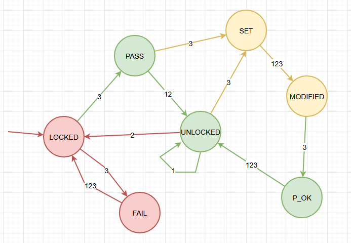

# Digital 4-digit PIN code lock system

User documentation

Author: Matúš Farkaš

## General description
Digital 4-digit PIN code lock system is an access withdraw system simulator.

Features:

- Unlocks
  - To unlock the system one has to set the correct pass code with buttons.
- Locks
  - When unlocked, it is possible to lock the system again an arbitrary number of times easily.
- Updates
  - When unlocked, it is possible to set a new password for the system easily.
- Attempts
  - The system keeps track and shows the user the number of remaining attempts to unlock the system.
- Messages
  - 4 character long messages keep the user informed of what state the system is in.
- Persists
  - It is able to remember the password set even after it is starved of electrical power.
- Defends
  - It is not possible to distinguish how many code digits are correct by timing the length of time the system takes to verify the code.
- Forgives
  - After failing to unlock the system the user has to solve a little puzzle before getting 3 more attempts to guess the code.

## Entry requirements

- Computer: ATmega328P
- Accessories: Multi-function Shield

## Entry configuration

- PIN code: 0000
- Number of attempts: 3
- After connecting the computer to the power source:
  - Display reads `0000`.
  - Current system state is `LOCKED`.

## Controls / Behaviour / State Changes

### LOCKED state

Shows 4 numeral digits (current code), initially `0000`.

- Button 1: Increment current digit value.
- Button 2: Moves cursor showing currently selected digit to the right.
- Button 3: Attempts to unlock the lock system. (changes state to `PASS`, `FAIL` or `DEAD`).

Failed attempt decreases the number of remaining attempts by 1.

Failing to unlock the system with 0 remaining attempts left changes the state to `DEAD`

### PASS state

Shows `PASS` text.

- Button 1: Changes state to `FREE`.
- Button 2: Changes state to `FREE`.
- Button 3: Starts the procedure for setting the new PIN code (changes state to `SET`).

### FAIL state

Shows `FAIL` text.

- Button 1: Changes state to `LOCKED`.
- Button 2: Changes state to `LOCKED`.
- Button 3: Changes state to `LOCKED`.

### FREE state

Shows `FREE` text.

- Button 1: Does nothing.
- Button 2: Locks the system (changes state to `LOCK`).
- Button 3: Starts the procedure for setting the new PIN code (shows `SET` text).

### LOCK state

Shows `LOCK` text.

- Button 1: Locks the system (changes state to `LOCKED`).
- Button 2: Locks the system (changes state to `LOCKED`).
- Button 3: Locks the system (changes state to `LOCKED`).

### SET state

Shows `SET` text.

- Button 1: Changes state to `MODIFIED`.
- Button 2: Changes state to `MODIFIED`.
- Button 3: Changes state to `MODIFIED`.

### MODIFIED state

Shows 4 digits (current code).

- Button 1: Increment current digit value.
- Button 2: Moves cursor showing currently selected digit to the right.
- Button 3: Confirms the selected code as the new PIN code (changes state to `GOOD`).

### GOOD state

Shows `GOOD` text.

- Button 1: Changes state to `FREE`.
- Button 2: Changes state to `FREE`.
- Button 3: Changes state to `FREE`.

### DEAD state

Initially shows `DEAD` text. Afterwards able to show any 4-character text.

- Button 1: Increment current character value.
- Button 2: Moves cursor showing currently selected character to the right.
- Button 3: Attempts to revive the lock system. (can change the state to `LOCKED` when the display reads `LOCK`).
